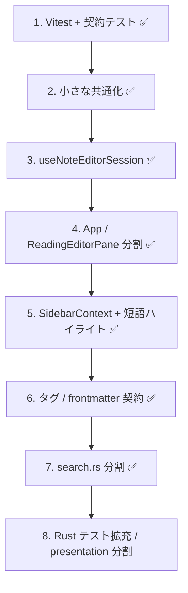

# リファクタリングロードマップ

最終更新: 2026-05-29

プロジェクト全体のリファクタリング候補を優先度付きで整理したドキュメント。実装コストに見合うものだけを掲載している。

関連:

- [search-roadmap.md](./search-roadmap.md) — 検索機能の TODO
- [search-scoring.md](./search-scoring.md) — スコアリング仕様
- [search-contract.json](./search-contract.json) — FE↔BE 検索契約の正
  - [frontmatter-contract.json](./frontmatter-contract.json) — FE↔BE タグ / FM 契約の正
  - [callout-contract.json](./callout-contract.json) — FE↔BE callout パース契約の正

---

## サマリー

| 領域 | 状態（2026-05-29） |
|------|---------------------|
| フロント God コンポーネント | **解消済み** — `App.tsx`（354 行）、`ReadingEditorPane.tsx`（279 行）は hook / 子コンポーネント配線中心 |
| FE ↔ BE 二重実装 | 検索・タグ/FM・**callout** は契約テスト完了（#3/#4/#5/#10）。UI 専用ロジックは FE 残存 |
| テスト | フロント **119 テスト / 16 ファイル**（Vitest）。Rust **108 unit + 1 ignored**（`cargo test`）。CI: `.github/workflows/ci.yml` |
| 型 | `AppConfig` 正規化は FE 内で統一済み（#11）。Rust ↔ TS の型生成は未 |
| スタイル | callout / テーマ preset は **shared/** に統一（#10）。default パレット（`:root` / `.dark`）は App 専用 |

### 完了済み（高優先 #1〜#7, #11〜#15）

Vitest 導入、App / ReadingEditorPane 分割、`useNoteEditorSession` 共通化、検索・タグ/FM 契約テスト、短語ハイライト修正、エラーハンドリング統一、`useNotesData` 分割、`SidebarContext` 化、**#21 エラーコード CI**、**#16 Rust テスト拡充**、**#9/#10** presentation / CSS、**#17–#19** 低優先整理、**#22/#23** hook / Settings 分割。

### 次の候補

1. **#20** 薄い hook 統合（`useSearchHighlight` — 可読性優先なら現状維持可）
2. 意図的後回し項目（invoke ラッパー化、型生成等）— ロードマップ「後回し」参照

---

## ファイルサイズ早見表

| ファイル | 行数 | 分類 |
|---------|------|------|
| `src-tauri/src/notes/search/mod.rs` | 735 | 検索オーケストレーション（分割後） |
| `src-tauri/src/notes/search/query_parse.rs` | 193 | クエリパース |
| `src-tauri/src/notes/search/scoring.rs` | 118 | マッチ・スコア・ソート |
| `src-tauri/src/presentation/mod.rs` | 516 | 提示オーケストレーション（分割後） |
| `src-tauri/src/presentation/server.rs` | 193 | HTTP / SSE ルート |
| `src-tauri/src/presentation/viewer_html.rs` | 164 | viewer HTML 生成 |
| `shared/theme-presets.css` | 84 | sepia / high-contrast preset（FE / viewer 共有） |
| `shared/theme-viewer-base.css` | 20 | viewer default トークン |
| `shared/md-callout.css` | 86 | callout 色（FE / viewer 共有） |
| `src-tauri/src/presentation/viewer.css` | 152 | viewer レイアウト |
| `src/App.css` | 323 | テーマ + markdown スタイル |
| `src/components/app/SettingsPanel.tsx` | 175 | 設定シェル（保存先 + 子セクション配線） |
| `src/components/app/SettingsTagsSection.tsx` | 247 | タグ管理・孤立タグ・一括置換 |
| `src/components/app/SettingsThemeSection.tsx` | 89 | テーマ / preset |
| `src/App.tsx` | 354 | ルート配線（分割完了） |
| `src/hooks/useAppSettings.ts` | 367 | 設定パネル state |
| `src/hooks/usePresentationSession.ts` | 310 | ブラウザ提示 |
| `src/hooks/useEditorMarkdownShortcuts.ts` | 298 | エディタ shortcut |
| `src/components/app/ReadingEditorPane.tsx` | 279 | コンポーネント（分割完了） |
| `src/hooks/useNoteEditorSession.ts` | 251 | App / NoteWindow 共通編集 |
| `src/hooks/useNoteNavigation.ts` | 230 | CRUD・検索ナビ |
| `src/components/app/ManagerPanel.tsx` | 238 | 一覧管理（props 配線） |
| `src/components/app/Sidebar.tsx` | 379 | サイドバー（Context 消費、props 0） |
| `src/contexts/SidebarContext.tsx` | 90 | サイドバー Context 定義 |
| `src/hooks/useSidebarContextValue.ts` | 154 | App → SidebarProvider 組み立て |
| `src-tauri/src/attachments.rs` | 383 | 画像添付 |
| `src-tauri/src/preview_render.rs` | 381 | プレビュー HTML 生成 |
| `src/lib/messages.ts` | 292 | 文言集約（意図的） |
| `src/lib/noteTags.ts` | 200 | FE タグ（Rust と重複） |
| `src/lib/noteImages.ts` | 170 | 画像 attach 純関数 |
| `src/hooks/useTauriImageDrop.ts` | 29 | Tauri ドロップ hook |
| `src-tauri/src/notes/frontmatter.rs` | ~175 | Rust タグ / FM（パーサ統合済み・契約テストあり） |
| `src-tauri/src/notes/match_strategy.rs` | 267 | 検索マッチ（テストあり） |
| `src/hooks/useManagerSearch.ts` | 136 | 一覧管理検索 |
| `src/hooks/useNotesData.ts` | 128 | 一覧・サイドバー検索 |
| `src/NoteWindowApp.tsx` | 118 | 別ウィンドウ（`useNoteEditorSession` 利用） |
| `src/lib/fuzzyMatch.ts` | 117 | fuzzy マッチ（契約テストあり） |
| `src/lib/searchHighlight.tsx` | 113 | プレビューハイライト |
| `src/lib/handleInvokeError.ts` | 20 | invoke エラー統一 |

---

## 推奨実施順序

**方針:** God コンポーネントと配線の整理は一段落。次は FE↔BE 契約の拡大（タグ）と Rust 側のモジュール分割。

---

## 高優先度

### 1. God コンポーネント: `App.tsx` ✅ 完了（2026-05-29）

| 項目 | 内容 |
|------|------|
| **場所** | `src/App.tsx`（1080 行 → **354 行**） |
| **実施内容** | layout / settings / presentation / navigation / contextMenu hooks に分割。`useOpenManager`、`CollapsedSidebarRail`、`SidebarProvider` 配線 |
| **残り** | Settings / Manager / Editor の 3 パネル JSX 配線のみ（意図的に残存） |
| **規模** | 完了 |

### 2. God コンポーネント: `ReadingEditorPane.tsx` ✅ 完了（2026-05-29）

| 項目 | 内容 |
|------|------|
| **場所** | `src/components/app/ReadingEditorPane.tsx`（1609 行 → **279 行**） |
| **実施内容** | preview / toolbar / shortcuts / 画像 insert / スクロール同期 / 行番号ガターを子コンポーネント・hook へ分割 |
| **残り** | なし |
| **規模** | 完了 |

### 3. FE ↔ BE ロジック重複: fuzzy 検索 ✅ 契約 + ハイライト完了（2026-05-29）

| 項目 | 内容 |
|------|------|
| **場所** | `src/lib/fuzzyMatch.ts` ↔ `src-tauri/src/notes/match_strategy.rs` |
| **実施内容** | `docs/search-contract.json` + `npm run test:contract`。`fuzzyWordHighlightRanges` が Rust `FuzzyMatcher` と同順（部分一致 → fuzzy）。短語ハイライト修正 |
| **残り** | 実装の単一化（Rust からハイライト範囲を返す等）は任意。契約テストで同期は担保済み |
| **規模** | 中（契約完了） |

### 4. FE ↔ BE ロジック重複: 検索クエリパース ✅ 契約テスト完了（2026-05-29）

| 項目 | 内容 |
|------|------|
| **場所** | `src/lib/searchQueryParse.ts` ↔ `src-tauri/src/notes/search.rs` の `parse_raw_terms` |
| **実施内容** | 同一 JSON の `bodyHighlightTerms`（FE）と `rawTerms`（BE）+ Rust 側 body 語整合テスト |
| **残り** | 長期的には Rust からハイライト用語リストを返す Tauri コマンドで TS パーサ削除も可 |
| **規模** | 中（契約完了） |

### 5. FE ↔ BE ロジック重複: タグ / フロントマター ✅ 完了（2026-05-29）

| 項目 | 内容 |
|------|------|
| **場所** | `src/lib/noteTags.ts` ↔ `src-tauri/src/notes/frontmatter.rs`、`src/lib/reservedTags.ts` ↔ `src-tauri/src/system_notes.rs` |
| **第 1 段** | Rust パーサ統合、`docs/frontmatter-contract.json` v1（パース・正規化） |
| **第 2 段** | `toggleTagInContent` ↔ `toggle_tag_in_content`、`rebuildNoteFrontmatterTags` ↔ `rebuild_note_frontmatter_tags` の **tags 結果**契約。予約タグ定数 + `isBuiltinReservedTagName` 契約。Rust に `SHORTCUTS_PURPOSE_TAG` / `BUILTIN_TAGS_SHORTCUTS` 追加 |
| **残り** | Markdown 全文のバイト一致契約、TS パーサ削除（任意） |
| **規模** | 完了（実用範囲） |

### 6. `App.tsx` と `NoteWindowApp.tsx` の重複 ✅ 完了（2026-05-29）

| 項目 | 内容 |
|------|------|
| **場所** | `src/App.tsx` vs `src/NoteWindowApp.tsx`（**118 行**） |
| **実施内容** | `hooks/useNoteEditorSession.ts` を追加。`lib/paneResize.ts`、`lib/utils.ts` の `clamp`、`lib/notePath.ts` の `fileNameFromPath` |
| **規模** | 完了 |

### 7. フロントエンドテスト ✅ 完了（2026-05-29、継続拡充中）

| 項目 | 内容 |
|------|------|
| **場所** | `npm test` / `npm run test:watch` / `npm run test:contract` |
| **実施内容** | Vitest 導入。**98 テスト / 13 ファイル**: 上記 + `frontmatterContract`、`handleInvokeError` 等 |
| **副次修正** | `searchQueryParse.ts` — 引用符内 `#work` を Rust と揃えて修正 |
| **規模** | 中（基盤完了） |

---

## 中優先度

### 8. 巨大 Rust モジュール: `search.rs` ✅ 完了（2026-05-29）

| 項目 | 内容 |
|------|------|
| **場所** | `src-tauri/src/notes/search/`（1023 行 → **mod 735 / query_parse 193 / scoring 118**） |
| **実施内容** | `query_parse.rs`（パース + パーステスト）、`scoring.rs`（マッチ・スコア・ソート）、`mod.rs`（検索オーケストレーション + 統合テスト + Tauri コマンド）。`parse_raw_terms` 等は `search` から re-export |
| **残り** | なし |
| **規模** | 中（完了） |

### 9. 巨大 Rust モジュール: `presentation.rs` ✅ 完了（2026-05-29）

| 項目 | 内容 |
|------|------|
| **場所** | `presentation.rs`（906 行）→ `presentation/{mod,server,viewer_html}.rs` + `shared/theme-*.css` / `viewer.css` |
| **実施内容** | HTTP/SSE を `server.rs`、viewer HTML を `viewer_html.rs` に分離。CSS は `include_str!` で外部ファイル化（+3 unit test） |
| **残り** | JS は `viewer_html.rs` 内に残存（#10 callout CSS 整理と連動可） |
| **規模** | 大（完了） |

### 10. プレビュー / callout ロジックの多重実装 ✅ 完了（2026-05-29）

| 項目 | 内容 |
|------|------|
| **場所** | `shared/md-callout.css`（色の正）、`docs/callout-contract.json`、`calloutContract.test.ts` / `callout_contract.rs` |
| **実施内容** | callout 色を `shared/md-callout.css` に集約。テーマ preset を `shared/theme-presets.css` + `shared/theme-viewer-base.css` に集約（`viewer_theme.css` 削除）。パース契約を JSON + FE/Rust テストで同期 |
| **残り** | Rust viewer は `__label` テキスト、FE は `__icon` SVG（意図的差分） |
| **規模** | 中（完了） |

### 11. 型の非対称: `AppConfig` / テーマ ✅ 完了（2026-05-29）

| 項目 | 内容 |
|------|------|
| **場所** | `src/types/config.ts` ↔ `src/lib/config.ts` |
| **実施内容** | `normalizeAppConfig` / `normalizeThemeMode` / `normalizeThemePreset` / `applyConfigTheme` を `lib/config.ts` に集約 |
| **規模** | 小 |

### 12. パス正規化の重複 ✅ 完了（2026-05-29）

| 項目 | 内容 |
|------|------|
| **場所** | `src/lib/notePath.ts`、`App.tsx`、`Sidebar.tsx` |
| **実施内容** | `normalizePathKey` を削除し `normalizeNotePath` に統一。`fileNameFromPath` を共通化 |
| **規模** | 小 |

### 13. エラーハンドリングの不統一 ✅ 完了（2026-05-29）

| 項目 | 内容 |
|------|------|
| **場所** | `src/lib/handleInvokeError.ts`、主要 hooks / `SettingsPanel` / `NoteWindowApp` |
| **実施内容** | `handleInvokeError`（ログ + 文言変換）と `reportStatusError`（+ ステータス表示）。Rust `search_task_failed` を `app_error` 定数化 |
| **残り** | `FirstRunSetupDialog` 等の軽微な catch |
| **規模** | 小（本体完了） |

### 14. `useNotesData` の責務過多 ✅ 完了（2026-05-29）

| 項目 | 内容 |
|------|------|
| **場所** | `src/hooks/useNotesData.ts`（272 行 → **128 行**） |
| **実施内容** | `useManagerSearch`（seed hits・filteredDetails・open/close）、`useNoteSelection`（選択・一括削除）に分割 |
| **規模** | 完了 |

### 15. Prop drilling: `Sidebar` ✅ 完了（2026-05-29）

| 項目 | 内容 |
|------|------|
| **場所** | `src/components/app/Sidebar.tsx`（props **27 個 → 0 個**） |
| **実施内容** | `SidebarContext` + `useSidebarContextValue` で検索・提示・ナビ・ホバーを提供 |
| **補足** | `ManagerPanel` 等は props のまま（数が許容範囲。無理な Context 化は不要） |
| **規模** | 完了 |

### 16. Rust テストカバレッジの偏り ✅ 完了（2026-05-29）

| 項目 | 内容 |
|------|------|
| **場所** | 追加: `config.rs`（7）、`tag_global.rs`（12）、`system_notes.rs`（4）、`frontmatter.rs`（+2）、`edit_lock.rs`（2）、`crud.rs`（7） |
| **実施内容** | 純関数抽出 → unit test。`edit_lock`: `take_edit_lock` / `release_edit_lock_if_holder`。`crud`: `resolve_save_target_path` / `next_dated_note_path` / preview・title ヘルパ等 |
| **残り** | Tauri コマンド本体の E2E は未（FS + AppHandle 依存）。ロジックの主要分岐は unit でカバー |
| **規模** | 完了 |

---

## 低優先度

### 17. 未使用 / デッドコード ✅ 完了（2026-05-29）

| 項目 | 内容 |
|------|------|
| **実施内容** | `mergeDiscoveredTemplateTags` / `isNoteWindowMode` 削除。Rust `ATTACHMENT_IMPORT_FAILED` を `import_from_path` で使用 |
| **規模** | 小（完了） |

### 18. 内部専用関数の export ✅ 完了（2026-05-29）

| 項目 | 内容 |
|------|------|
| **実施内容** | `findNoteDetailForHit` / `fuzzyPathsFromSearchHits` を module 内 private 化。テストは `noteDetailsFromSearchHits` 経由に統合 |
| **規模** | 小（完了） |

### 19. CSS / Tailwind クラスの重複 ✅ 完了（2026-05-29）

| 項目 | 内容 |
|------|------|
| **実施内容** | `Button variant="toolbar"` を追加。`EditorEditToolbar` / `PreviewPaneToolbar` / `Sidebar` / `CollapsedSidebarRail` の重複 className を置換 |
| **規模** | 小（完了） |

### 20. 薄い hook の統合

| 場所 | 内容 |
|------|------|
| `src/hooks/useSearchHighlight.tsx`（12 行） | `searchHighlight.tsx` の 1 行 `useMemo` ラッパーのみ |

**規模:** 小（可読性優先なら現状維持も許容）

### 21. `messages.ts` と `app_error.rs` の手動同期 ✅ 完了（2026-05-29）

| 項目 | 内容 |
|------|------|
| **場所** | `src/lib/checkErrorCodes.ts`、`src/lib/errorCodesContract.test.ts`、`.github/workflows/ci.yml` |
| **実施内容** | Rust 定数 40 件 ↔ `messages.errors` キー一致を `npm run check:error-codes`（Vitest）で検証。`unknown` は FE 専用フォールバックとして除外。GitHub Actions CI に組み込み |
| **規模** | 小（完了） |

### 22. `noteImages.ts` の hook 配置 ✅ 完了（2026-05-29）

| 項目 | 内容 |
|------|------|
| **実施内容** | `useTauriImageDrop` を `hooks/useTauriImageDrop.ts` へ移動。`noteImages.ts` は純関数のみ |
| **規模** | 小（完了） |

### 23. `SettingsPanel.tsx` の分割余地 ✅ 完了（2026-05-29）

| 項目 | 内容 |
|------|------|
| **実施内容** | `SettingsThemeSection` / `SettingsTagsSection` に分割。`SettingsPanel` はヘッダー・保存先・配線のみ（435 → 175 行） |
| **規模** | 小（完了） |

---

## 意図的に後回しでよいもの

| 項目 | 理由 |
|------|------|
| 全 `invoke` 呼び出しのラッパー化 | 現状 25 箇所程度で許容範囲 |
| Context の全面導入 | Sidebar は Context 化済み（#15）。他コンポーネントは props が許容範囲ならそのまま |
| tantivy 導入 | [search-roadmap.md](./search-roadmap.md) でも「必要になったら」 |
| `useSearchHighlight.tsx` の統合だけ | 単独では benefit 小 |

---

## 進捗メモ

| 日付 | 内容 |
|------|------|
| 2026-05-29 | 初版作成（コードベース全体調査に基づく） |
| 2026-05-29 | **#6 完了** — `useNoteEditorSession` で App / NoteWindow の編集セッション共通化 |
| 2026-05-29 | **#7 完了** — Vitest 導入 + 純関数モジュールにテスト追加（現在 76 件） |
| 2026-05-29 | **#11/#12 完了** — `normalizeAppConfig` / `notePath` 共通化 |
| 2026-05-29 | **#1 完了** — App.tsx 1080 → 354 行（layout / settings / presentation / navigation hooks） |
| 2026-05-29 | **#2 完了** — ReadingEditorPane 1609 → 279 行 |
| 2026-05-29 | **#3/#4 契約テスト** — `docs/search-contract.json` + `npm run test:contract` |
| 2026-05-29 | **#3 短語ハイライト** — `fuzzyWordHighlightRanges` を Rust `FuzzyMatcher` と同順に修正 |
| 2026-05-29 | **#13 完了** — `handleInvokeError` / `reportStatusError`、`search_task_failed` 定義 |
| 2026-05-29 | **#14 完了** — `useNotesData` を `useManagerSearch` / `useNoteSelection` に分割 |
| 2026-05-29 | **#15 完了** — `SidebarContext` で props 27 → 0 |
| 2026-05-29 | **#5 第 2 段** — toggle / rebuild tags 契約、予約タグ定数同期（`frontmatter-contract.json` v2） |
| 2026-05-29 | **#8 完了** — `search.rs` を `search/{mod,query_parse,scoring}.rs` に分割 |
| 2026-05-29 | **ロードマップ最新化** — 行数・テスト数・完了状態をコードベースと同期 |
