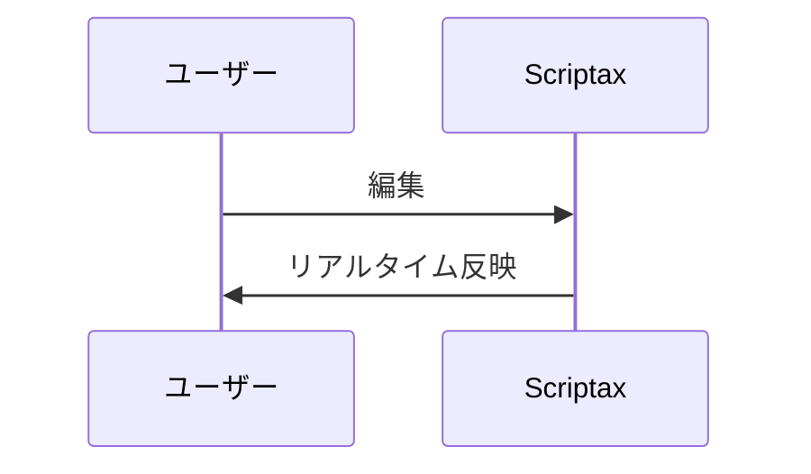
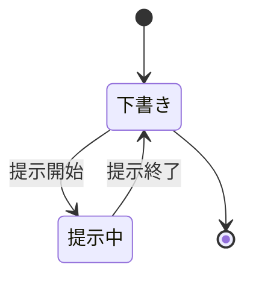

# 🚀 Markdown 構文リファレンス

## 見出し

# h1 見出し1
## h2 見出し2
### h3 見出し3
#### h4 見出し4

## 1. 注釈構文 (Custom Directives)

:::note info
インフォメーション
ここに補足情報を記載します。
:::

:::note warn
警告
設定ファイルの書き換えには注意してください。
:::

:::note alert
より強い警告
このコマンドを本番環境で実行しないでください。
:::

---

## 2. 基本的な装飾

- **太字**: `**Bold**` -> **太字**
- *斜体*: `*Italic*` -> *斜体*
- ~~打ち消し~~: `~~Strikethrough~~` -> ~~打ち消し~~
- `インラインコード`: `` `code` `` -> `const x = 42;`

---

## 3. リストとタスク

- 箇条書き
  - ネスト
- 番号付き
1. 項目1
2. 項目2

- [x] 完了タスク
- [ ] 未完了タスク

> 引用テキスト

---

## 4. コードブロック (言語指定)

```rust
fn main() {
    let message = "Tauri は最高です";
    println!("{}", message);
}
```

---

## 5. テーブル (GFM)

パイプ `|` で列を区切り、2 行目に `-` の行（区切り行）を置きます。  
エディタでは **`Ctrl/Cmd + T`** で下のひな形を挿入できます。

### 基本

| 列 A | 列 B | 列 C |
|------|------|------|
| 1    | 2    | 3    |
| 左   | 中央 | 右   |

### 記法（ソース）

    | 列 A | 列 B | 列 C |
    |------|------|------|
    | 1    | 2    | 3    |
    | 左   | 中央 | 右   |

- 1 行目: ヘッダー
- 2 行目: `---`（列数分。`|---|` を並べる）
- 3 行目以降: データ行
- セル内に `|` を書く場合は `\|` でエスケープ

### 列の配置（GFM）

区切り行の `-` の左右に `:` を付けると配置を指定できます（プレビューでは環境により差が出る場合があります）。

| 左寄せ | 中央寄せ | 右寄せ |
|:-------|:--------:|-------:|
| A      | B        | C      |

    | 左寄せ | 中央寄せ | 右寄せ |
    |:-------|:--------:|-------:|
    | A      | B        | C      |

---

## 6. 図 (Mermaid)

**言語指定 `mermaid` のコードブロック** で記述します。アプリのプレビューとブラウザ提示の両方で描画されます。  
テーマ（ライト / ダーク）はアプリの設定に追従します。

### フローチャート


記法（ソース）:

    ```mermaid
    graph LR
      A[メモ] --> B[プレビュー]
      B --> C[提示]
    ```

方向の例: `graph TD`（上→下）、`graph LR`（左→右）

### シーケンス図



### その他の例（状態遷移）



### ヒント

- フェンスの直後は `mermaid` と書く（`mmd` も可）
- 複雑な図は行を増やしすぎると横スクロールになることがあります
- 構文エラー時は図の代わりにエラー表示になる場合があります

